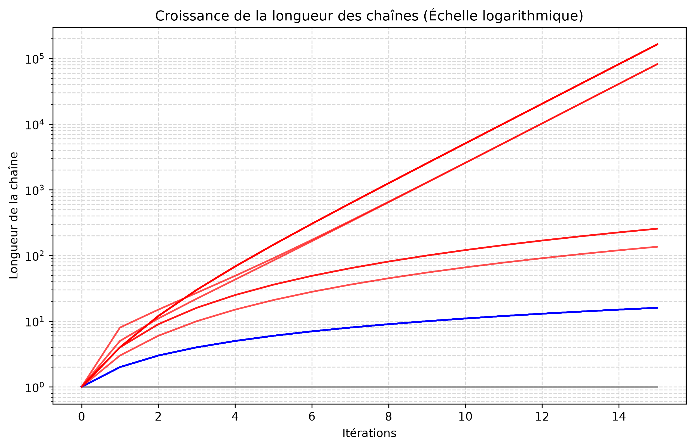
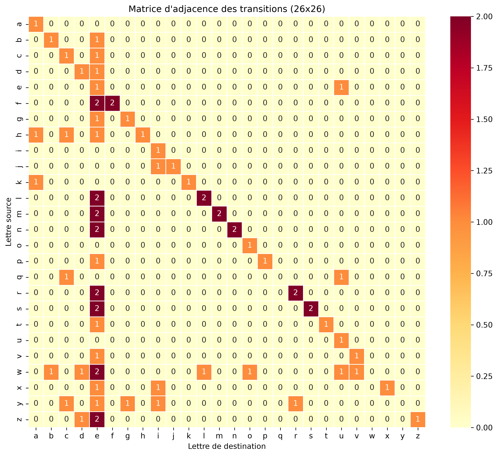
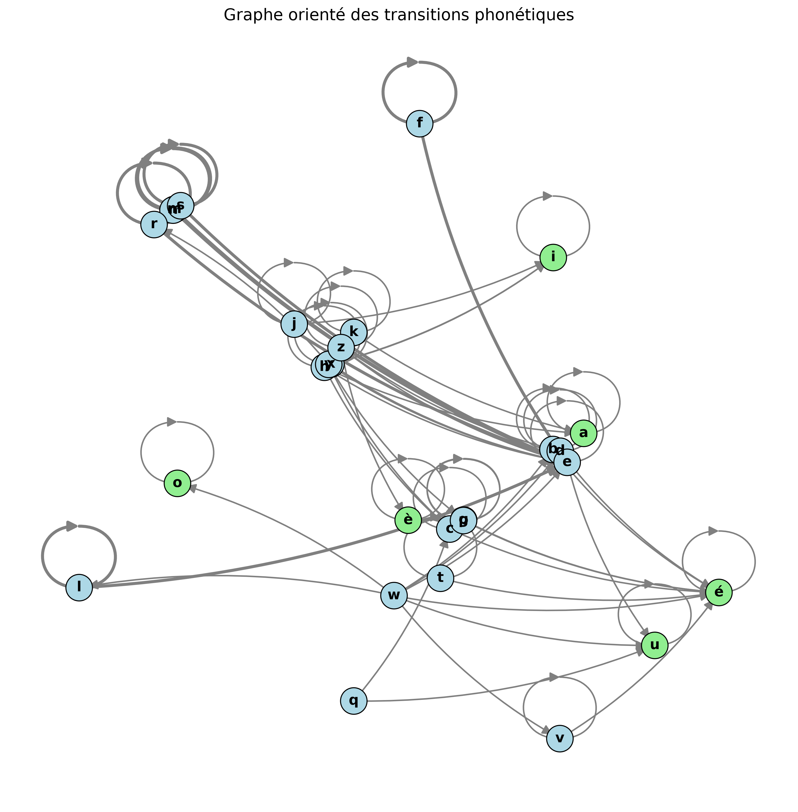
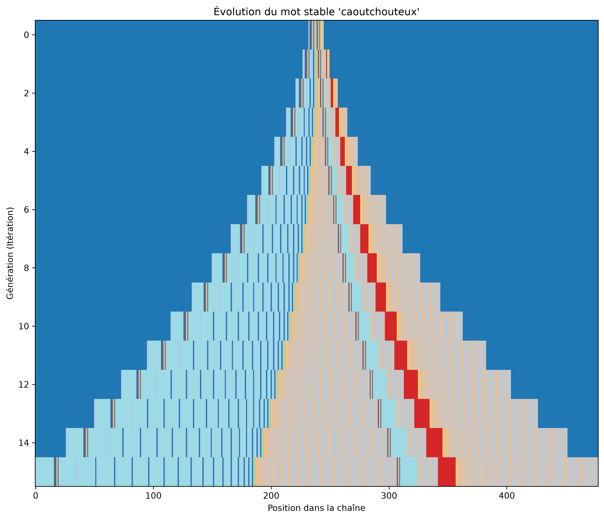
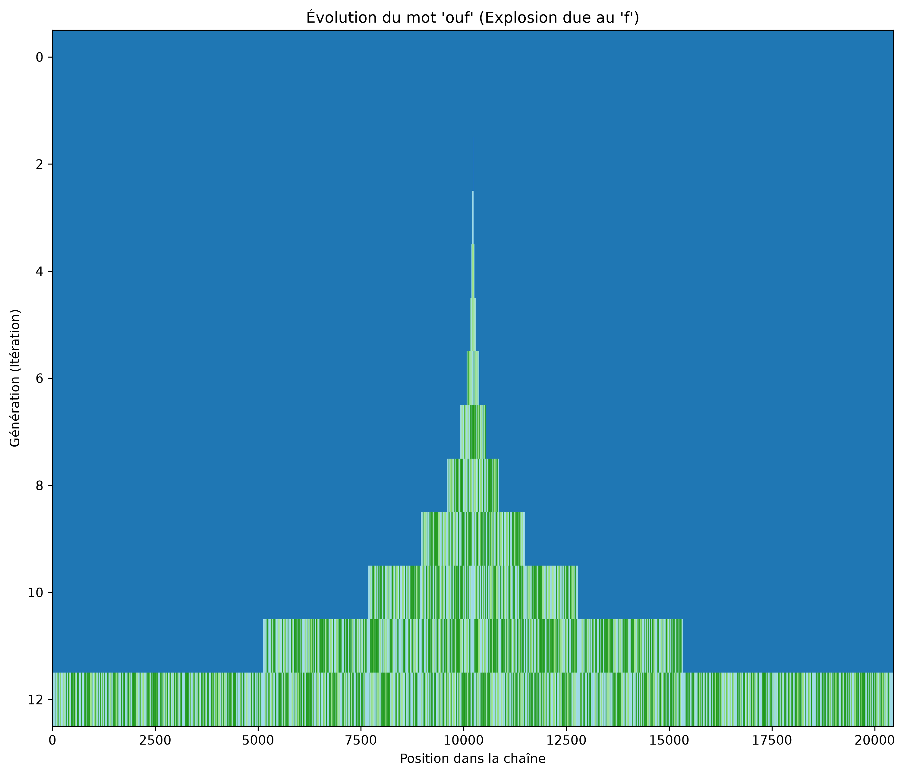

# alphabet-rewrite-2012

A string rewriting system (L-system) i thought about when i was ~8yo. 

Il s'agit d'un automate où chaque lettre est remplacée par son épellation phonétique à chaque itération (ex: `c` $\rightarrow$ `cé`, `e` $\rightarrow$ `eu`, etc.).

## 1. Complexité Asymptotique (Croissance des lettres)
En appliquant les règles itérativement, on se rend compte que les lettres ne grandissent pas toutes à la même vitesse.
- **O(1) - Constante** : Les "puits" (lettres terminales comme `a`, `i`, `o`, `u`, `é`, `è`)
- **O(n) - Linéaire / O(n²) - Quadratique** : Les lettres qui n'entrent pas dans des boucles infinies de rétroaction.
- **O(2^n) - Exponentielle** : Les lettres qui finissent par générer d'autres lettres exponentielles (ex: `f`, `l`, `m`, `n`, `r`, `s`, `w`, `y`).

## 2. Heatmap et Matrice d'Adjacence
Si l'on représente les règles phonétiques sous la forme d'un graphe, on obtient la matrice de transition $26 \times 26$ suivante. Les blocs colorés indiquent les rétroactions et dépendances entre les lettres.

## 3. Le Graphe Réseau (Théorie des graphes)
Chaque lettre est un nœud, chaque règle phonétique crée des arêtes dirigées.
Ce graphe montre immédiatement :
- **En vert clair** : Les puits (nœuds terminaux)
- **En bleu clair** : Les chemins et les cycles. Les cycles (comme la lettre `e` qui génère `e`+`u`) causent l'explosion exponentielle de la chaîne.

---

## 4. Ingénierie Inverse : Mots Stables et "Game of Life"

Si l'axiome de départ n'est pas une simple lettre mais un mot complet, la chaîne subit les mêmes lois.
Un mot est **stable** s'il ne contient aucune lettre exponentielle (`f`, `l`, `m`, `n`, `r`, `s`, `w`, `y`). Sa croissance restera au maximum polynomiale $O(n^2)$.

### Les mots stables les plus longs
En analysant un dictionnaire français complet (~330 000 mots), les mots **les plus longs** ne provoquant **aucune explosion exponentielle** font 13 lettres de long. Il s'agit de :
* `caoutchouteux`
* `hippophagique`
* `caoutchoutait`
* `caoutchoutiez`
* `caoutchoutage`

*(Amusant : la famille de "caoutchouc" domine complètement ce classement !)*

### Le "Game of Life" des mots (Automate Cellulaire)
Si on aligne les chaînes générées à chaque génération et qu'on assigne une couleur à chaque lettre, on observe des motifs rappelant le "Jeu de la Vie" de Conway.

#### Évolution du mot stable `caoutchouteux`
Les lettres polynomiales grandissent paisiblement et créent des motifs symétriques (lignes droites et triangles). C'est une croissance maitrisée et prévisible.

#### L'explosion du mot `ouf`
À l'inverse, si l'on prend un mot d'apparence inoffensive comme `ouf`, la présence du `f` (lettre exponentielle) agit comme une "graine" chaotique. En quelques itérations, la structure explose et le motif devient un bruit dense et asymétrique.

