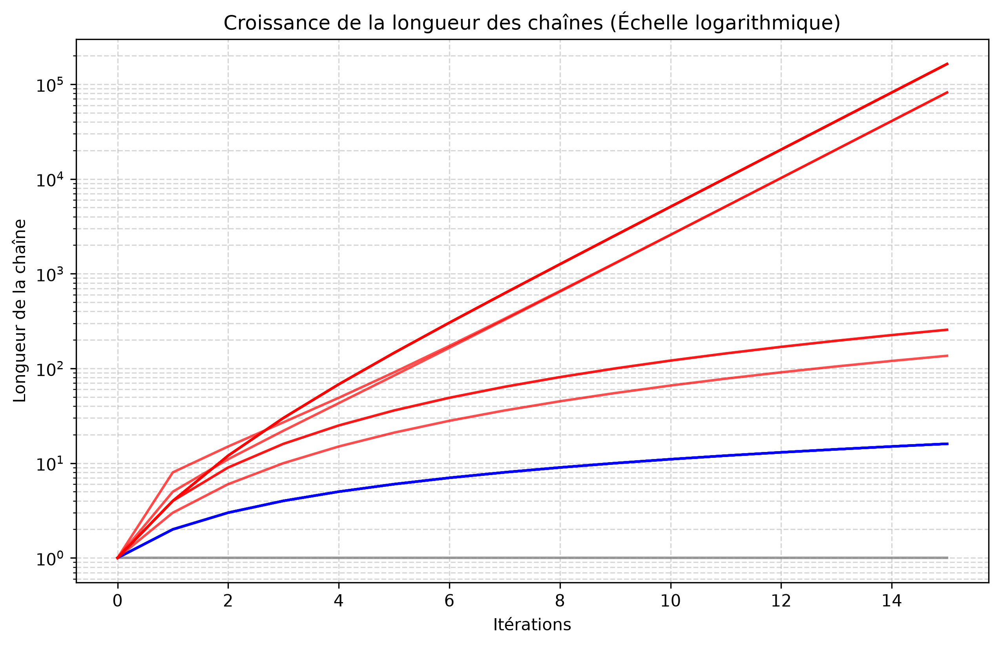
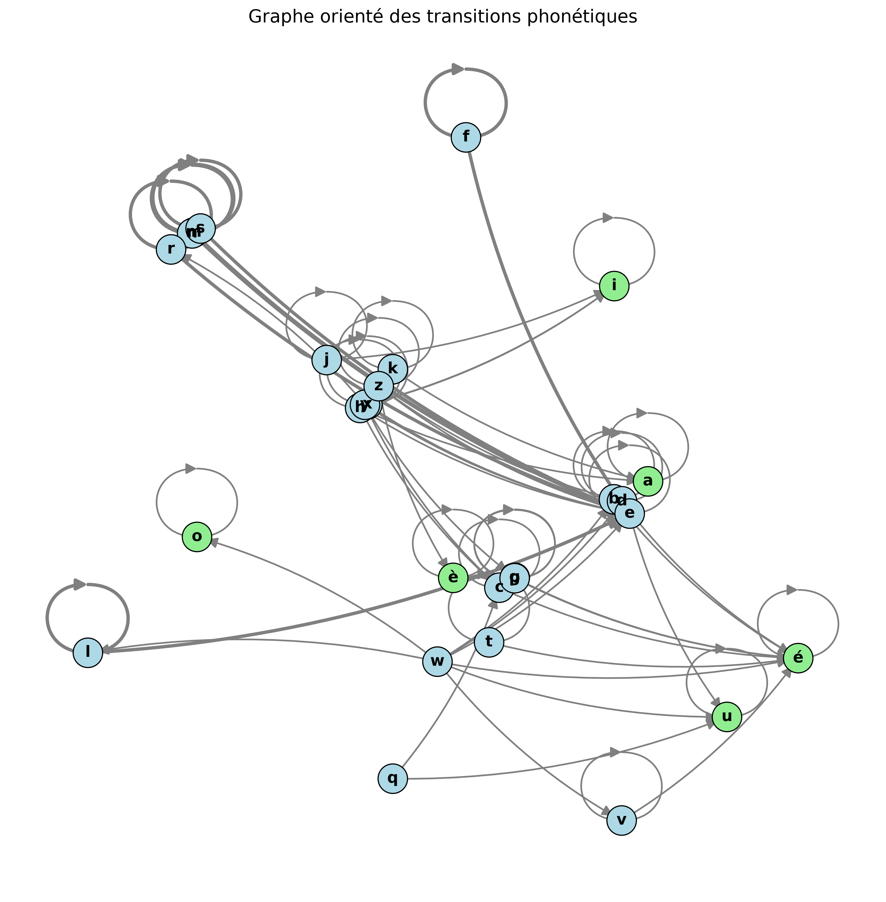
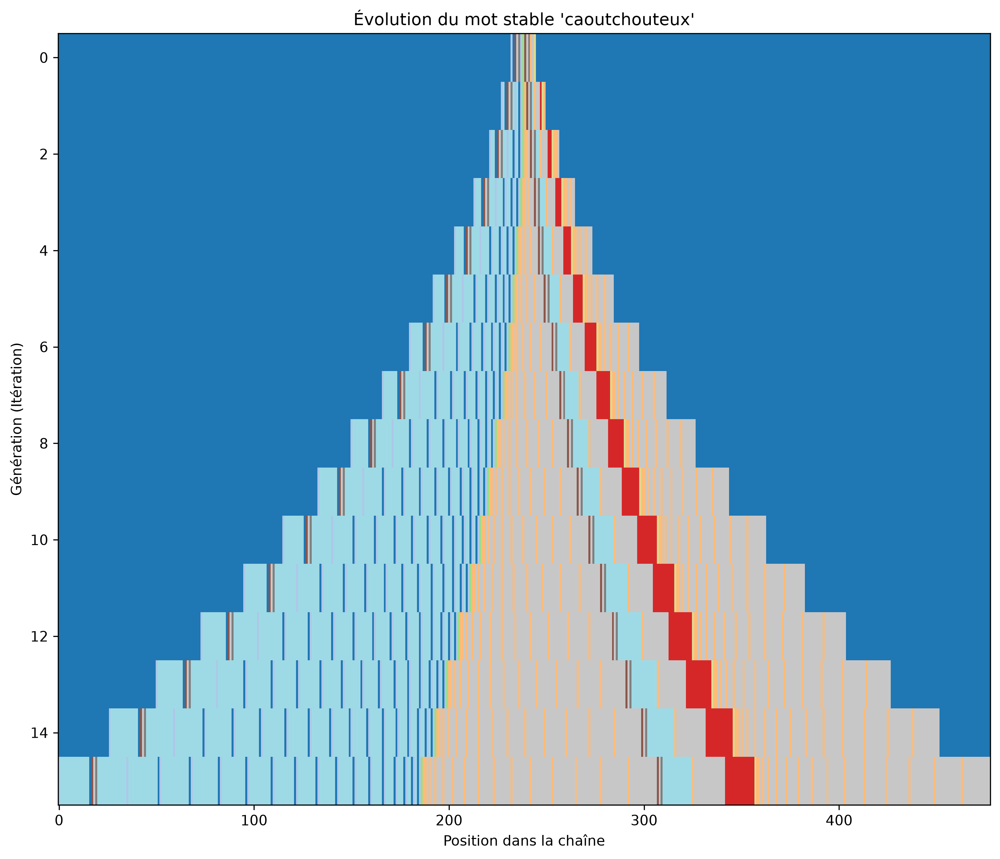
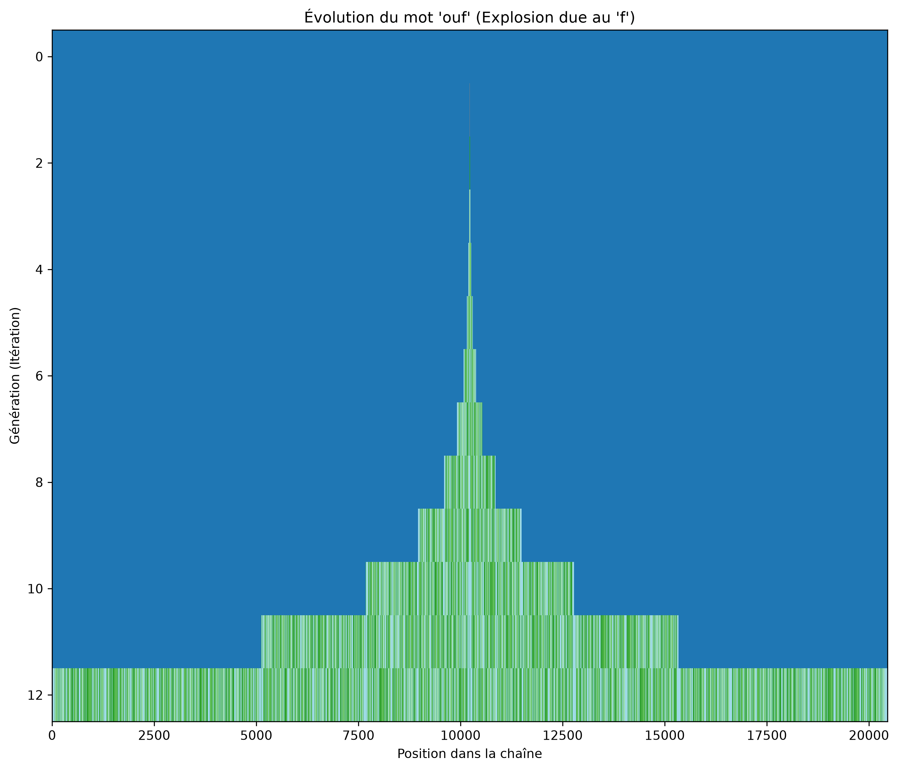

# alphabet-rewrite-2012

> **Tech Stack : Python • Algorithms • Discrete Math • Matplotlib**  
> Deterministic phonetic string rewriting system (L-system) formalizing recursive letter expansions and sequence dynamics.

---

## L'idée de base

L'idée m'est venue un après-midi chez mes grands-parents alors que j'étais puni et obligé de faire des devoirs de vacances : **prendre une lettre, l'épeler phonétiquement, puis réécrire chaque lettre du mot obtenu avec sa propre prononciation, et répéter le processus à l'infini.**

En formalisant ce jeu des années plus tard, il s'agit d'un **système de Lindenmayer (L-système)** déterministe, proche de la suite audioactive de Conway.

---

## Le principe (exemple avec H)

Prenons la lettre **H** :
1. **Étape 0** : `h` (longueur 1)
2. **Étape 1** : `h` s'épelle "ache" $\rightarrow$ `a c h e` (longueur 4)
3. **Étape 2** : on réécrit chaque lettre selon sa prononciation :
   - `a` $\rightarrow$ `a`
   - `c` $\rightarrow$ `cé`
   - `h` $\rightarrow$ `ache`
   - `e` $\rightarrow$ `eu`  
   Ce qui donne `a cé ache eu` (longueur 9)
4. **Étape 3** : longueur 16, puis 25, 36...

La suite des longueurs suit exactement la suite des carrés parfaits : **$L_n = (n+1)^2$** (croissance quadratique $O(n^2)$).

---

## Les résultats

### 1. Classification de l'alphabet (4 régimes de croissance)

En appliquant ce système aux 26 lettres de l'alphabet français, on découvre 4 classes de complexité dynamique bien distinctes :

| Régime | Lettres | Comportement |
|---|---|---|
| **$O(1)$ — Constant** | **A, I, O, U, É, È** | Lettres terminales / puits : elles ne génèrent qu'elles-mêmes. |
| **$O(n)$ — Linéaire** | **B, C, D, E, G, J, K, P, Q, T, V** | Croissance régulière pas à pas (ex. $c \rightarrow c\acute{e} \rightarrow c\acute{e}\acute{e}$). |
| **$O(n^2)$ — Quadratique** | **H, X, Z** | Croissance polynomiale en carré parfait (matrice d'adjacence triangulaire). |
| **$O(2^n)$ — Exponentiel** | **F, L, M, N, R, S, W, Y** | Explosion combinatoire due à des cycles de rétroaction (ex. $f \rightarrow effe$). |

  
  

---

### 2. Mots complets & automate cellulaire ("Game of Life")

En appliquant les règles non plus à une lettre isolée mais à un mot entier :

- **Mots stables** : un mot dont aucune lettre n'est exponentielle a une croissance maîtrisée au plus quadratique. Dans un dictionnaire de 330 000 mots français, les plus longs mots stables font 13 lettres (ex. `caoutchouteux`, `hippophagique`).
- **Visualisation façon Jeu de la Vie** : chaque lettre est associée à une couleur. Un mot stable comme `caoutchouteux` forme un motif géométrique régulier, tandis qu'un mot contenant une lettre exponentielle comme `ouf` explose rapidement en bruit chaotique.

  
  

